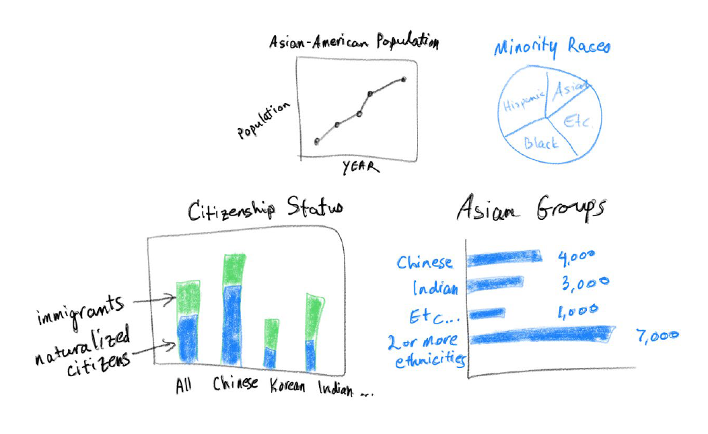

# Final Project

# 
Asian Pacific American Heritage Month
 

### Brief Abstract
The Asian American demographic is becoming the fastest growing racial group in the United States. While the Asian population represents about 5.6% of the total American population, or about 20 million people, it has grown 102% since 2000. This also means the number of Asian American voters and eligible voters are on the rise. Unsurprinsingly, California accounts for the largest Asian American population in the lower 48 states (aka Lower 48). 

This project will delve into a detailed analysis of the Asian American population. We will examine the number of immigrations from Asian countries within the last 20 years, the rate of naturalization, and voter registration statistics. This analysis will provide a nuanced understanding of the diverse Asian American community and its impact/influence on American elections.

Fun Project - Exploring various socio-economic indicators such as literacy rates, income levels, poverty rates, student enrollments, and unemployment rates among these groups.

|  | 1980 | 1990 | 2000 | 2010 | 2020 |  
| ----- | ---- | ---- | ---- | ---- | ---- | 
| Total # of Asian American | 1 | 2| 3 | 4 | 5 |  
| Total # of Naturalized Citizens | 1 | 2 | 3 | 4 | 5 |
| Total # of Registered Voters | 1 | 2 | 3 | 4 | 5 | 

### Prototype 
 

### Link/Citation for Data  
https://data.census.gov/  
https://aapidata.com/data/demographics/  
https://apiavote.org/policy-and-research/aapi-demographics-by-state/  
https://www.bestcolleges.com/research/aanhpi-asian-student-statistics/  
https://www.pewresearch.org/short-reads/2024/01/10/key-facts-about-asian-american-eligible-voters-in-2024/  
https://www.pewresearch.org/short-reads/2021/04/29/key-facts-about-asian-americans/