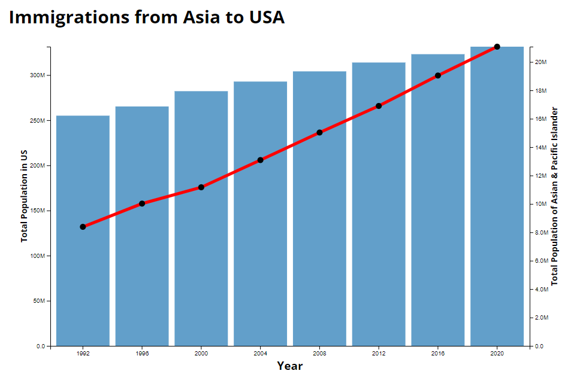
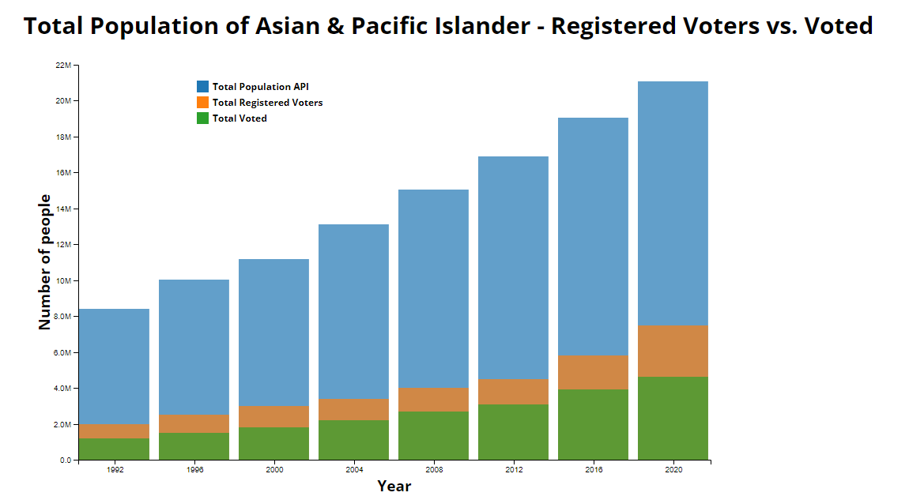

# Final Data Visualization Project

# 
Asian Pacific American Heritage Month
 

### Brief Abstract
The Asian American demographic is becoming the fastest growing racial group in the United States. While the Asian population represents about 5.6% of the total American population, or about 20 million people, it has grown 102% since 2000. This also means the number of Asian American voters and eligible voters are on the rise. Unsurprinsingly, California accounts for the largest Asian American population in the lower 48 states (aka Lower 48).

This project will delve into a detailed analysis of the Asian American population. We will examine the number of immigrations from Asian countries within the last 20 years, the rate of naturalization, and voter registration statistics. This analysis will provide a nuanced understanding of the diverse Asian American community and its impact/influence on American elections.

U.S. Census is using both data from Decennial Census and American Community Survey so the results will vary slightly.

It is worth noting that we must improve civic engagement among Asian & Pacific Islander population.

Fun Side Quest - 
Democrats vs Republicans  
Asian population in each state  
Immigrations from Top 5 Asian countries  

### Chart 1 
 

### Chart 2
 

### Link/Citation for Data  
https://www.census.gov/topics/population/race/about.html  
https://usafacts.org/data/topics/people-society/population-and-demographics/population-data/population/  
https://www.presidency.ucsb.edu/statistics/elections  
https://www.census.gov/data/tables/time-series/demo/voting-and-registration/voting-historical-time-series.html  
https://www.migrationpolicy.org/programs/data-hub/charts/number-immigrants-who-became-us-citizens  
https://www.migrationpolicy.org/article/naturalization-trends-united-states/  
https://www.uscis.gov/citizenship-resource-center/naturalization-statistics  
https://www.presidency.ucsb.edu/statistics/data/voter-turnout-in-presidential-elections  